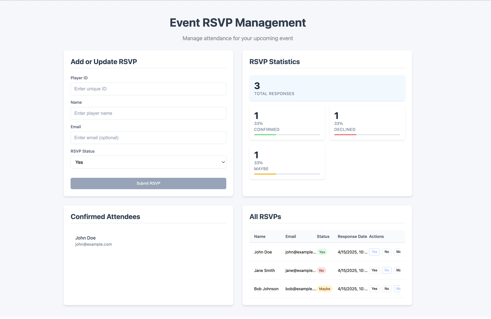

# RSVP Event App

An Angular-based RSVP Event Management application to collect and manage attendee responses for an event.

The app now includes a full capacity and waitlist workflow:

1. Confirmed attendees are limited by a configurable capacity.
2. Extra Yes RSVPs are automatically moved to a waitlist.
3. If a confirmed attendee changes from Yes to No/Maybe, the first waitlisted attendee is auto-promoted.



## What This App Does

1. Create or update RSVP responses using Player ID, name, email, and status.
2. Show live RSVP statistics for total, confirmed, declined, maybe, and waitlisted.
3. Manage event capacity from the UI.
4. Display confirmed attendees separately from waitlisted attendees.
5. View all RSVP records in a table with seat assignment status.

## Current RSVP Rules

1. RSVP statuses supported: Yes, No, Maybe.
2. Only Yes RSVPs are eligible for confirmed seats.
3. Confirmed seats are allocated by earliest response time.
4. If Yes responses exceed capacity, overflow is assigned to waitlist positions.
5. Waitlist positions are recalculated automatically whenever status or capacity changes.

## Tech Stack

1. Angular 20 (standalone components)
2. TypeScript 5
3. RxJS
4. Karma + Jasmine for unit testing
5. Angular SSR dependency included for server-side rendering support

## Project Structure

Core app layout:

1. src/app/home
2. src/app/models
3. src/app/services

Main functional pieces:

1. home component: page orchestration, data refresh, capacity change handling
2. rsvp form component: create or update RSVP input flow
3. rsvp list component: full RSVP table and status actions
4. rsvp stats component: dashboard metrics
5. confirmed attendees component: confirmed attendee list
6. rsvp service: business logic for RSVP state, capacity, waitlist, and counts

## Setup

### Prerequisites

1. Node.js 20+
2. npm 10+

### Install dependencies

```bash
npm install
```

## Run the App

Start development server:

```bash
npm start
```

Then open:

http://localhost:4200/

Note:

1. Use npm start or ng serve.
2. npm serve is not a valid script in this project.

## Available Scripts

1. npm start: start dev server (ng serve)
2. npm run build: production build
3. npm run watch: development build in watch mode
4. npm test: run unit tests (watch mode by default)
5. npm run serve:ssr:rsvp-app: run built SSR server output

## Build

```bash
npm run build
```

Build output:

dist/rsvp-app

## Test

Default tests:

```bash
npm test
```

One-time headless run:

```bash
npm run test -- --watch=false --browsers=ChromeHeadless
```

Covered service behavior includes:

1. create and update RSVP entries
2. counts and attendee filtering
3. waitlist overflow when capacity is reached
4. waitlist promotion when a confirmed attendee declines
5. waitlist rebalancing when capacity changes

## Core Dependencies (Current)

Runtime:

1. @angular/common ^20.3.18
2. @angular/compiler ^20.3.18
3. @angular/core ^20.3.18
4. @angular/forms ^20.3.18
5. @angular/platform-browser ^20.3.18
6. @angular/platform-browser-dynamic ^20.3.18
7. @angular/router ^20.3.18
8. express 5.1.0

Development:

1. @angular/cli ^20.3.22
2. @angular-devkit/build-angular ^20.3.22
3. @angular/compiler-cli ^20.3.18
4. @angular/platform-server ^20.3.18
5. @angular/ssr ^20.3.22
6. karma, jasmine-core, and related launchers/reporters

## Security Note

Angular compiler vulnerability (GHSA-g93w-mfhg-p222) has been addressed by upgrading Angular packages to secure versions in the 20.3.18+ line.

## Troubleshooting

1. Command not found for ng:
   - Use npm start instead of ng serve if Angular CLI is not globally installed.
2. Port 4200 already in use:
   - Run ng serve --port 4300.
3. Test browser launch issues:
   - Ensure Chrome is installed for ChromeHeadless runs.

## Future Enhancements

Planned roadmap includes:

1. RSVP edit and cancellation history
2. Email confirmations and reminders
3. Duplicate detection and anti-spam controls
4. Admin dashboard with filters and export
5. Event-day check-in mode
